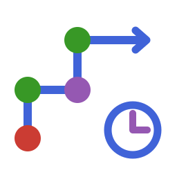

# TSNA.jl


[](https://github.com/statistical-network-analysis-with-Julia/TSNA.jl)
[](https://github.com/statistical-network-analysis-with-Julia/TSNA.jl/actions/workflows/CI.yml?query=branch%3Amain)
[](https://statistical-network-analysis-with-Julia.github.io/TSNA.jl/dev/)
[](https://julialang.org/)
[](https://opensource.org/licenses/MIT)

<p align="center">
  
</p>

Temporal Social Network Analysis for Julia.

## Overview

TSNA.jl provides descriptive analysis tools for dynamic networks, including temporal centrality measures, temporal path analysis, reachability analysis, and duration metrics.

This package is a Julia port of the R `tsna` package from the StatNet collection.

## Installation

Requires Julia 1.12+. TSNA.jl depends on the unregistered
[NetworkCore.jl](https://github.com/statistical-network-analysis-with-Julia/NetworkCore.jl), [DynamicNetworks.jl](https://github.com/statistical-network-analysis-with-Julia/DynamicNetworks.jl), and [SNA.jl](https://github.com/statistical-network-analysis-with-Julia/SNA.jl) packages, which must be added first (in this order):

```julia
using Pkg
Pkg.add(url="https://github.com/statistical-network-analysis-with-Julia/NetworkCore.jl")
Pkg.add(url="https://github.com/statistical-network-analysis-with-Julia/DynamicNetworks.jl")
Pkg.add(url="https://github.com/statistical-network-analysis-with-Julia/SNA.jl")
Pkg.add(url="https://github.com/statistical-network-analysis-with-Julia/TSNA.jl")
```

The examples also load `DynamicNetworks` (to build dynamic networks) and
`NetworkCore` (for `nv`/`ne` on snapshots), both installed above.

For development, clone the repositories side by side (directory names
`<Pkg>.jl`) and `Pkg.develop(path=...)` them, or build an environment with the
organisation site's `tools/prepare_workspace.jl`. The `[sources]` path
dependencies then wire the sibling checkouts together.

## Features

- **Temporal centrality**: degree, betweenness, closeness, eigenvector and
  PageRank of the actors active at a time point
- **Temporal paths**: earliest-arrival (time-respecting) paths, temporal
  distances and forward/backward reachability, single-source or batched
- **Duration metrics**: edge/vertex activity durations, formation/dissolution
  events, persistence, turnover and tie decay
- **Aggregation**: snapshot statistics over time and collapse to a static network

### Semantics in brief

Activity follows R networkDynamic and tsna:

- **Activity.** An element with no spells is active throughout. The spells of
  one element are merged, so adjacent or overlapping spells form one lifetime.
- **Observation window.** Durations and event counts are taken over the
  observation window, with spells clipped to it. When no window was set, each
  statistic follows tsna's rule for that case: lifetimes and events read the
  spells unclipped (an open spell lasts `Inf`), `tied_duration` and
  `t_edge_density` use the range of the change times, series
  (`t_turnover`, `window_sna_stats`, `t_edge_persistence`) cover the
  *closed* range of the change times, and paths have no end. Where tsna
  would fall back to the placeholder range (0, 1) — a network with no finite
  spell bound — TSNA raises an `ArgumentError` asking for a window.
- **Censoring.** A bound cut by the window, or flagged censored, is not a
  formation or dissolution event unless `include_censored=true`.
- **Snapshot measures.** Per-vertex measures are computed on the actors active
  at the instant and returned by vertex ID, with `NaN` for absent actors.
  Density, reciprocity and transitivity also use the active actors.
  `active_only=false` uses the whole vertex universe.
- **Missing data.** Statistical and path queries reject masked (unobserved)
  dyads by default; `missing=:face` uses the recorded values.
- **Calendar time.** For `Date`/`DateTime` networks, durations and rates are in
  seconds. Numeric axes keep their native units.

All functions have snake_case names. The camelCase names of earlier
development versions (`tDegree`, `earliestArrival`, ...) are gone: they were
not R tsna functions, or had other meanings there. The documentation's
*Coming from R tsna* page has a rename table. See also
[Coming from R tsna](#coming-from-r-tsna).

## Quick Start

```julia
using DynamicNetworks
using TSNA

# Create dynamic network
dnet = DynamicNetwork(10; observation_start=0.0, observation_end=100.0)
for i in 1:10
    activate!(dnet, 0.0, 100.0; vertex=i)
end
activate!(dnet, 0.0, 60.0; edge=(1, 2))
activate!(dnet, 10.0, 80.0; edge=(2, 5))

# Temporal centrality at time 50
deg = t_degree(dnet, 50.0)
bet = t_betweenness(dnet, 50.0)

# Temporal path finding (from vertex 1 to vertex 5, starting at t=0)
dist = temporal_distance(dnet, 1, 5, 0.0)   # 10.0: wait at 2 until (2,5) opens
path = temporal_path(dnet, 1, 5, 0.0)       # the earliest-arrival path

# Reachability
reachable = forward_reachable_set(dnet, 1, 0.0)   # [1, 2, 5]
```

## Temporal Centrality

Each function returns one value per vertex ID. An actor absent at `at` gets
`NaN`, and normalisations divide by the number of active actors:

```julia
at = 50.0   # evaluation time used below

t_degree(dnet, at; mode=:total)      # :in, :out, or :total
t_betweenness(dnet, at)
t_closeness(dnet, at)
t_eigenvector(dnet, at)
t_pagerank(dnet, at; damping=0.85)

# Absent actors get NaN; active_only=false scores them as isolates
d2 = DynamicNetwork(3; observation_start=0.0, observation_end=10.0)
activate!(d2, 0.0, 10.0; edge=(1, 2))
activate!(d2, 5.0, 10.0; vertex=3)       # actor 3 joins at t = 5
t_degree(d2, 1.0)                        # [1.0, 1.0, NaN]
t_degree(d2, 1.0; active_only=false)     # [1.0, 1.0, 0.0]
```

## Temporal Network Measures

```julia
# At a time point
t_density(dnet, at)
t_reciprocity(dnet, at)
t_transitivity(dnet, at)

# Over time series
times = 0.0:10.0:100.0
stats = t_sna_stats(dnet, times; measures=[:density, :reciprocity])
```

## Temporal Paths

A temporal path must have non-decreasing times: an edge can only be traversed
while it is active. Edges with no spells are traversable at any time. Vertex
activity does not restrict paths, as in tsna.

```julia
# Elapsed time of the earliest time-respecting path (nothing if unreachable)
temporal_distance(dnet, 1, 5, 0.0)

# The earliest-arrival path itself, as a TemporalPath
p = temporal_path(dnet, 1, 5, 0.0)
p.vertices, p.times, path_duration(p)

# Who can vertex 1 reach starting at t = 0, and who can reach vertex 5 by t = 100?
forward_reachable_set(dnet, 1, 0.0)
backward_reachable_set(dnet, 5, 100.0)

# All sources at once
reachability_matrix(dnet, 0.0)
```

## Duration Metrics

```julia
# Per-edge total active time in the window: tsna::edgeDuration(nd)
t_edge_duration(dnet)
t_edge_duration(dnet; mode=:spell)        # one entry per (merged) spell
t_edge_duration(dnet; aggregate=:mean)    # a summary

# Vertex activity durations, clipped to the window
t_vertex_duration(dnet; aggregate=:mean)

# Formation / dissolution events (onsets / termini of merged spells) in
# [onset, terminus); censored bounds count only with include_censored=true
n_form = t_edge_formation(dnet, 0.0, 50.0)
n_diss = t_edge_dissolution(dnet, 0.0, 50.0)

# Proportion of edges surviving across consecutive 10-unit windows
persistence = t_edge_persistence(dnet, 10.0)

# Formation/dissolution counts and rates per 10-unit window
turnover = t_turnover(dnet, 10.0)

# Per-edge weights decayed by time since last activity
weights = tie_decay(dnet; method=:exponential)
```

Clipped durations of censored spells understate tie lifetimes. No
censoring-aware (Kaplan–Meier) estimator is provided.

## Aggregation

```julia
# Statistics at multiple time points
times = collect(0.0:5.0:100.0)
stats = t_sna_stats(dnet, times; measures=[:density, :n_edges, :mean_degree])

# Snapshot statistics at the start of each window of width 20
stats = window_sna_stats(dnet, 20.0; measures=[:density])

# Aggregate to static network (vertex IDs stable)
static = t_aggregate(dnet; method=:union)         # active at some point
static = t_aggregate(dnet; method=:intersection)  # active throughout
static = t_aggregate(dnet; method=:weighted)      # weight = active time
```

## Contact Sequences

```julia
# One contact per contiguous activity of an edge, sorted by onset
cs = as_contact_sequence(dnet)
[(c.source, c.target, c.time, c.duration) for c in cs]
```

## Coming from R tsna

| R tsna | TSNA.jl |
|:--|:--|
| `tPath(nd, v, "fwd")` | `earliest_arrival`, `temporal_path`, `temporal_distance`, `forward_reachable_set` |
| `tPath(nd, v, "bkwd")` | `backward_reachable_set` (the exact dual of the forward search) |
| `forward.reachable` | `forward_reachable_set` |
| `tSnaStats(nd, "degree")`, `tDegree` | `t_degree` at each time (`NaN` for absent actors) |
| `tSnaStats(nd, "betweenness"/"closeness"/"evcent"/"gden"/"grecip"/"gtrans")` | `t_betweenness`, `t_closeness`, `t_eigenvector`, `t_density`, `t_reciprocity`, `t_transitivity` |
| `tiedDuration(nd)` | `tied_duration(dnet)` |
| `tEdgeDensity(nd)` | `t_edge_density(dnet)` |
| `edgeDuration(nd)` / `subject = "spells"` | `t_edge_duration(dnet)` / `mode=:spell` |
| `vertexDuration(nd)` | `t_vertex_duration(dnet)` (also clips finite spells to the window) |
| `tEdgeFormation` / `tEdgeDissolution` series | `t_edge_formation` / `t_edge_dissolution` per window; `t_turnover(dnet, 1)` is the default series on a network without a window |
| `tReach` | `reachability_matrix` (no sampling) |

The full table, with every signature and semantic difference, is the
documentation's "Coming from R tsna" page. The R agreement is pinned by a
golden fixture generated with tsna 0.3.6 and sna 2.8:

- durations, formation and dissolution series, `tiedDuration`, `tEdgeDensity`
  and sna snapshot measures on 60 random one-mode networks observed over a
  window, and on 20 two-mode and looped ones;
- the same statistics and `tsna::tPath` from every vertex on 44 networks
  **without** an observation window (one-mode, two-mode and looped, plus the
  edge cases: a tie forming at the last change time, a dissolution at the
  first, no finite spell bound at all);
- 10 samplk-style panels built with `networkDynamic(network.list = ...)`.

## Not implemented

- **From tsna:**
  - `tReach` seed sampling and the backward direction;
  - `tErgmStats`, `pShiftCount`, `timeProjectedNetwork`;
  - the `tPath` object helpers and plots (`is.tPath`, `as.network.tPath`,
    `plot.tPath`, `plotPaths`).
- **Paths:**
  - latest-departure paths (`type = "latest.depart"`), traversal costs
    (`graph.step.time`) and `forward.reachable`'s `per.step.depth`;
  - vertex activity does not restrict paths (as in tsna).
- **Snapshot statistics:**
  - applying an arbitrary sna function over a time grid (`tSnaStats`'s
    `snafun`);
  - interval snapshots (`aggregate.dur`, `rule`).
- **Durations and events:**
  - censoring-aware estimators (such as Kaplan–Meier): durations are observed
    and clipped, so means are biased downward when many spells are censored;
  - `edgeDuration`'s `subject = "dyads"` and `mode = "counts"`, and
    `tEdgeFormation`'s `result.type = "fraction"`.

## Documentation

For more detailed documentation, see:

- [Documentation](https://statistical-network-analysis-with-Julia.github.io/TSNA.jl/dev/)

## References

1. Bender-deMoll, S., Morris, M. (2025). tsna: Tools for Temporal Social Network Analysis. R package version 0.3.6. [https://cran.r-project.org/package=tsna](https://cran.r-project.org/package=tsna)

2. Moody, J. (2002). The importance of relationship timing for diffusion. *Social Forces*, 81(1), 25-56.

3. Holme, P., Saramaki, J. (2012). Temporal networks. *Physics Reports*, 519(3), 97-125.

## Citation

If you use TSNA.jl in your work, please cite it using the entry in
[`CITATION.bib`](CITATION.bib):

```biblatex
@misc{SNWJTSNAJL,
  author = {Santoni, Simone},
  title = {TSNA.jl: Temporal Social Network Analysis for Julia},
  year = {2026},
  url = {https://github.com/statistical-network-analysis-with-Julia/TSNA.jl},
  note = {Homepage: https://statistical-network-analysis-with-Julia.github.io/TSNA.jl; GitHub: https://github.com/statistical-network-analysis-with-Julia}
}
```

TSNA.jl implements, and is validated against, the R package `tsna`.
**Please also cite the R package** — Bender-deMoll and Morris
(`citation("tsna")` in R gives the current entry) — and the methods papers
of the measures you use; the per-package list is at
<https://statistical-network-analysis-with-julia.github.io/citing/>.

## License

MIT License - see [LICENSE](LICENSE) for details.
